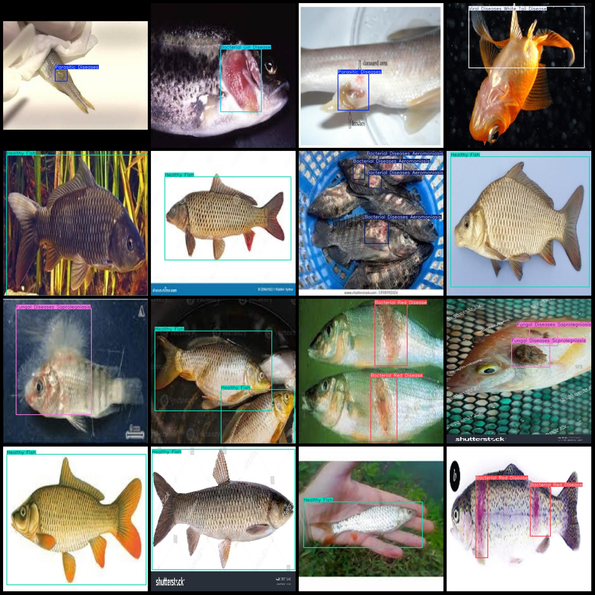
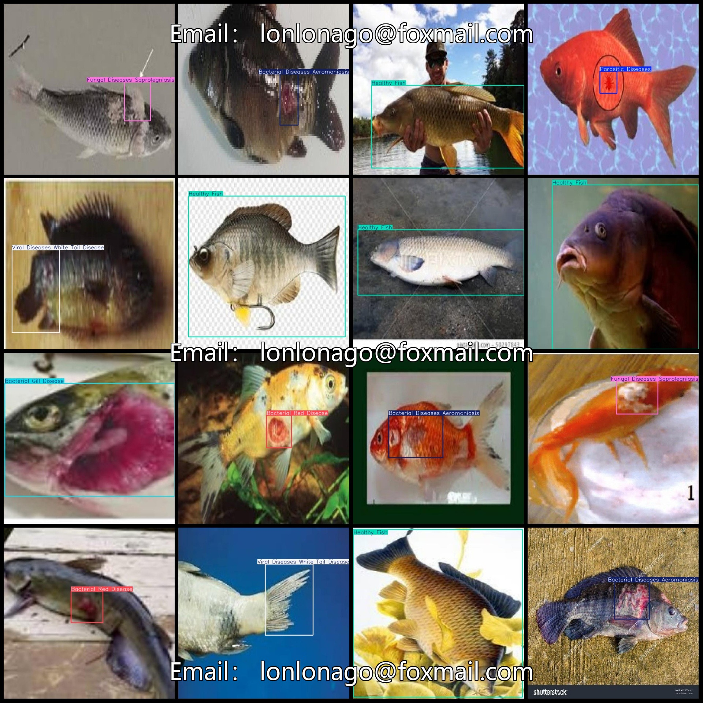

# Aquatic Disease Detection Dataset for Intelligent Aquaculture with VOC+YOLO format and 457 Images of 7 Categories

Dataset format: Pascal VOC format + YOLO format (without split path in txtfile, only contains jpgimage and corresponding VOC format xmlfile and yolo format txtfile)
number of images: 457  
annotation count: 457  
annotation count: 457  
annotationnumber of classes: 7  
Annotation class names: ["Bacterial Diseases Aeromoniasis", "Bacterial Gill Disease", "Bacterial Red Disease", "Fungal Diseases Saprolegniasis", "Healthy Fish", "Parasitic"]
Diseases","Viral Diseases White Tail Disease"]  
Each category has a specified number of bounding boxes.
Bacterial Diseases Aeromoniasis with a box count of 54 and images of 49.
Bacterial Gill Disease (BGD) is a disease caused by bacteria in the water, which can affect fish. The box count indicates that there are 58 instances of BGD detected in the images.
Bacterial Red Disease (BRD), also known as bacteriophage red disease, is a bacterial infection that affects salmonids such as Atlantic salmon. It is caused by the bacteriophage BRD-1 and is characterized by a reddish-pink color on the skin of the fish. The box count indicates the number of bacteria present in a sample of water, while images refers to the number of images or videos available for reference.
The text describes a fungal disease called Saprolegniasis, which is commonly known as "water mold" or "mold of the water." The box count indicates that there are 85 instances of this disease. There are also 48 images associated with this topic.
The number of Healthy Fish frames is 227, and the number of images they occupy is 177.
This is a list of 53 parasite diseases, with images included for each one.
Viral Diseases White Tail Disease
Box Count = 56, Images = 43
total boxes: 601  
Image resolution: 640x640
Using annotation tool: labelImg
Annotation rule: Draw a rectangle around the class.
Important notes: The dataset does not have separate training, validation, and test sets. You need to partition them yourself.
Special statement: This dataset does not guarantee any accuracy for the trained model or weight file.
Image preview:
## Images

Here is a pay link on Stripe ( https://buy.stripe.com/3cs8yP7sY87d0vu9AB ). Please contact me lonlonago@foxmail.com after funding $89, and I will send you a complete data files , thank you!

